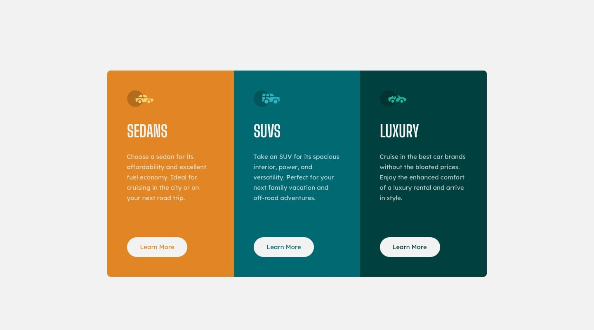

# fm-3-columns-preview (3 Columns Preview Page)

## Design Preview

> Desktop Design

> Mobile Design

## General

My challenge is to build out this 3-column preview card component and get it looking as close to the design as possible.

My users should be able to:

- View the optimal layout depending on their device's screen size
- See hover states for interactive elements